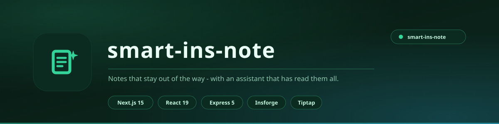

<div align="center">

<picture>
  <source media="(prefers-color-scheme: light)" srcset="docs/assets/banner-light.svg">
  <source media="(prefers-color-scheme: dark)" srcset="docs/assets/banner.svg">
  
</picture>

<br>

**Notes that stay out of the way, and an assistant that has read all of them.**

A three-panel notes workspace in the Standard Notes mould - starring, archiving, trash, tags, full-text search, auto-save - with an AI chatbot wired into the same backend and a memory that persists between sessions.

<br>


<br>

[**Features**](#features) &nbsp;&nbsp;|&nbsp;&nbsp; [**The AI layer**](#the-ai-layer) &nbsp;&nbsp;|&nbsp;&nbsp; [**Architecture**](#architecture) &nbsp;&nbsp;|&nbsp;&nbsp; [**Running it**](#running-it) &nbsp;&nbsp;|&nbsp;&nbsp; [**API**](#api)

</div>

---

## What it is

A notes app lives or dies on two things: how fast you can get a thought in, and whether you can find it a month later.

The workspace is the familiar three-panel layout - sidebar, note list, editor - because that shape works and there is no reason to reinvent it. What is less usual is what sits underneath: every note is reachable by the AI assistant, and the assistant remembers things about you between conversations.

<div align="center">

|  |  |
|:---|:---|
| **Front end** | Next.js 15 App Router, React 19 |
| **Editor** | Tiptap rich text, two-row organised toolbar |
| **Backend** | Express 5 - proxies every data call |
| **Persistence** | Insforge (cloud Postgres-compatible BaaS) |
| **AI** | Multi-provider router - OpenAI, Anthropic, Google, OpenRouter |
| **Validation** | Zod, OpenAPI-generated schemas |
| **Monorepo** | pnpm workspaces, Node 24, TypeScript 5.8 |

</div>

---

## Features

### The workspace

- **Three-panel layout** - sidebar, note list, editor
- **Views** - Notes, Starred, Archived, Trash
- **Note actions** - star, archive, trash, restore, delete forever
- **Tags** created and deleted straight from the sidebar
- **Full-text search** across both title and content
- **Auto-save** on a 600 ms debounce - you never press save
- **Dark and light mode**
- **Responsive** note counts and date formatting

### The editor

- **Tiptap rich text** with a deliberately organised two-row toolbar
  - Row 1 - History, Type, Format, Colour, Align
  - Row 2 - Lists, Block, Insert
- **3D clay SVG icons** - 14 hand-built icons for the sidebar nav

### The AI layer

- **Chatbot panel** wired to the real backend, with your notes as context
- **Multi-provider routing** - bring a key for OpenAI, Anthropic, Google or OpenRouter and the router picks the provider
- **AI Key Manager** - add and remove provider keys from inside the app
- **AI Memory** - the assistant keeps context about you across sessions instead of starting blank every time

---

## Architecture

```
artifacts/
  notes-next/          Next.js 15 App Router   (/notes-next/)
  smart-notes/         React 19 + Vite         (/)
  api-server/          Express 5               (/api)
  mockup-sandbox/      Vite component preview  (/__mockup)
lib/
  api-spec/            OpenAPI spec (source of truth)
  api-zod/             Generated Zod schemas
  api-client-react/    Generated React Query hooks
```

Every data call goes through the Express server. Nothing in the browser talks to the database directly, which is what lets provider API keys stay server-side.

---

## Running it

```bash
# install
pnpm install

# regenerate hooks and validators from the OpenAPI spec
pnpm --filter @workspace/api-spec run codegen

# API server
pnpm --filter @workspace/api-server run dev

# Next.js front end
pnpm --filter @workspace/notes-next run dev

# React + Vite front end
pnpm --filter @workspace/smart-notes run dev

# typecheck everything
pnpm run typecheck
```

### Environment

| Variable | Purpose |
|:---|:---|
| `INSFORGE_API_BASE_URL` | Insforge project base URL |
| `INSFORGE_API_KEY` | Insforge API key - server-side only |
| `INSFORGE_ANON_KEY` | Insforge anon JWT |
| `SESSION_SECRET` | Session secret |
| `GITHUB_TOKEN` | Only for pushing from the workspace - never needed at runtime |

> Provider API keys are **not** environment variables. You add them in the app and they are stored server-side, never returned to the frontend.

---

## API

| Method | Path | Purpose |
|:---|:---|:---|
| `GET` | `/api/healthz` | Health check |
| `GET` | `/api/notes` | List notes, newest first |
| `POST` | `/api/notes` | Create `{ title, content }` |
| `PATCH` | `/api/notes/:id` | Update `{ title?, content?, starred?, archived?, trashed? }` |
| `DELETE` | `/api/notes/:id` | Hard delete |
| `GET` `POST` | `/api/tags` | List / create tags |
| `DELETE` | `/api/tags/:id` | Delete a tag |
| `GET` `POST` | `/api/ai/keys` | List / save provider keys |
| `DELETE` | `/api/ai/keys/:provider` | Remove a provider key |
| `GET` `PATCH` | `/api/ai/settings` | AI settings |
| `GET` | `/api/ai/memory` | Stored memory entries |
| `POST` | `/api/ai/chat` | Chat, routed across providers |

---

## Data model

| Table | Columns |
|:---|:---|
| `notes` | id, title, content, starred, archived, trashed, created_at, updated_at |
| `tags` | id, name, color, created_at, updated_at |

---

## Licence

MIT - see [LICENSE](LICENSE).

Built by **Aizenrex x Riyad**.
